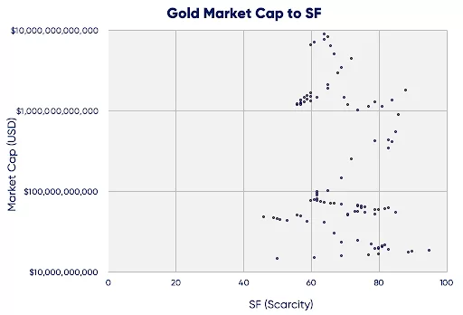

# Bitcoin Stock-to-Flow(S2F) Model

To fully grasp the Stock-to-flow model of anything, the first thing to do is to understand what are stock and flow are and how they affect the psrticular case, in this case, Bitcoin.

In simple terms, 
 - Stock is the size of existing reserves or stockpiles of a commodity.
 - Flow is the Yearly production rate of said commodity.

Stock-to-Flow ratio herein simply seeks to define a relationship between scarcity and value. A higher ratio indicates that the commodity is increasingly scarce, and therefore more valuable as a store of value. Taking Gold as a case study; 
 - Gold, having the highest SF, as at 2019 had a stock of about 185,000 tons and a flow of about 3,000 tons per year which drives its Stock-to-Flow ratio to a value of about 62, which simply means it took 62 collective years to accumulate that amount of gold at 2019, this serving as a huge PoW(Proof of Work). 

Using the same ideology, The Dutch Institutional Investor, (alias PlanB)'s model treats Bitcoin as being comparable to commodities such as gold, silver or platinum. These are known as 'store of value' commodities because they retain value over long time frames due to their relative scarcity. It is difficult to significantly increase their supply i.e. the process of searching for gold and then mining it is expensive and takes time. Bitcoin is similar because it is also scarce. In fact, it is the first-ever scarce digital object to exist. There are a limited number of coins in existence and it will take a lot of electricity and computing effort to mine the 3 million outstanding coins still to be mined, therefore the supply rate is consistently low. 

Bitcoin currently has a stock of ~18.5m coins and supply of ~0.35m/yr = SF ~50. This places bitcoin in the monetary goods category like silver and gold. Bitcoin's market value at current prices is $70bn.

Supply of bitcoin is fixed. New bitcoins are created in every new block. Blocks are created every 10 minutes (on average), when a miner finds the hash that satisfies the PoW required for a valid block. The first transaction in each block, called the coinbase, contains the block reward for the miner that found the block. The block reward consists of the fees that people pay for transactions in that block and the newly created coins (called subsidy). The subsidy started at 50 bitcoins, and is halved every 210,000 blocks (about 4 years). That's why 'halvings' are very important for bitcoins money supply and SF. Halvings also cause the supply growth rate (in bitcoin context usually called 'monetary inflation') to be stepped and not smooth.

### So why is the BitCoin Stock-to-Flow model a bad model?

What PlanB defines as “scarcity” is not scarcity by definition. PlanB uses “scarcity” to describe an asset’s supply growth rate or new production as measured by the SF metric. This assumes that increasing new supply depresses price through increased selling pressure from producers and vice versa. PlanB observed that because bitcoin's mining flow gets cut in half every four years, bitcoin's stock-to-flow ratio leaps every 4 years. These halving events boost Bitcoin's stock-to-flow ratio dramatically. It's reasonable to assume that the contracting supply is fueling the BTC's dramatic price rise.

Intuitively, the stock-to-flow model makes sense once you conduct a simple thought experiment. 

Using Gold as a case study once again, if the flow of gold suddenly slowed down. Instead of 3,000 tons of gold being mined annually, about only 1,000 tons of gold is mined, the price if Gold is expected to skyrocket. This would be a great way to prove the correlation between the Stock-to-Flow ratio of Gold and it's price.
Surprisingly, SF has no direct relationship with gold’s value over the last 115 years, as can be seen in the scatter plot below. 

Gold’s market capitalization held valuations between ~$60 billion to ~$9 trillion, all at the same SF value of 60. A range of $8 trillion is not very indicative of explanatory power and lends itself to the obvious conclusion that other factors drive gold’s USD valuation. 

# Black Scholes Call  Price

The Workings that provide the answer to the Black-Scholes call price as $2 can be found [here](https://github.com/youthtrouble/fuzzy-sniffle/blob/master/Finance/Finance.pdf).

